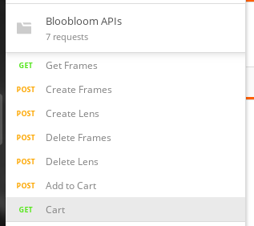

# README

Follow the below steps to setup the project

* Clone the repository and navigate into it.

* bundle install

* Run the migration : rails db:migrate

* Load the seed file: rails db:seed

* Open Postman and import the Bloobloom APIs.postman_collection.json file from the repository

* You should see below set of APIs on Postman:

* Start the server : rails s

* Hit APIs to see the APIs live in action.

